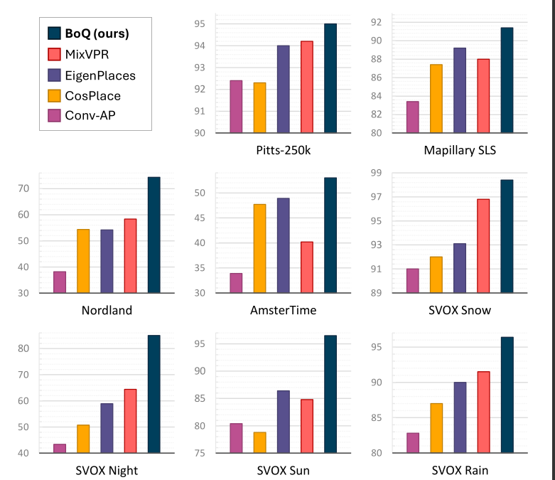

# BoQ: A Place is Worth a Bag of learnable Queries

This is the official repo for our CVPR 2024 paper "BoQ: A Place is Worth a Bag of learnable Queries"

### Summary

BoQ is a new architecture for visual place recognition that employs a set of global learned queries (Bag-of-Queries) to probe the input’s local features via cross-attention, insuring consistent information aggregation.

[[CVPR OpenAccess](https://openaccess.thecvf.com/content/CVPR2024/html/Ali-bey_BoQ_A_Place_is_Worth_a_Bag_of_Learnable_Queries_CVPR_2024_paper.html)] [[ArXiv](https://arxiv.org/abs/2405.07364)] [[BibTex](https://github.com/amaralibey/Bag-of-Queries?tab=readme-ov-file#cite)]

### Architecture


The input image is first processed by a backbone network (ResNet for example) to extract its local features, which are then sequentially refined in cascade. Each BoQ block contains a set of learnable queries $\mathbf{Q}$ (Learned Bag of Queries). The refined features $\mathbf{X}^i$ are then processed through cross-attention with $\mathbf{Q}$ for selective aggregation. Outputs from all BoQ blocks $(\mathbf{O}^1, \mathbf{O}^2, \dots, \mathbf{O}^L)$ are concatenated and linearly projected. The final global descriptor is L2-normalized to optimize it for subsequent similarity search.

### Results

We used GSV-Cities ([https://github.com/amaralibey/gsv-cities](https://github.com/amaralibey/gsv-cities)) for training, with images resized to 320$\times$320. We tested on 14 large scale benchmarks, as shown in the paper. Here are some results.



---

### Code

The Bag-of-Queries (BoQ) technique is easy to implement. Here is the implementation in PyTorch. Note that the self-attention between the learned queries is there for stability purposes (it adds contexts between the learned queries during the training), it can be cached during eval.

Positional encoding are not really necessary (since the 3x3 conv operation is preceding the transformer). If you want to use a lot of BoQ blocks, you can add positional embeding to `x` just before the `norm_input` operation.

```python
import torch

class BoQBlock(torch.nn.Module):
    def __init__(self, in_dim, num_queries, nheads=8):
        super(BoQBlock, self).__init__()
  
        self.encoder = torch.nn.TransformerEncoderLayer(d_model=in_dim, nhead=nheads, batch_first=True, dropout=0.)
        self.queries = torch.nn.Parameter(torch.randn(1, num_queries, in_dim))
  
        # the following two lines are used during training only, you can cache their output in eval.
        self.self_attn = torch.nn.MultiheadAttention(in_dim, num_heads=nheads, batch_first=True)
        self.norm_q = torch.nn.LayerNorm(in_dim)
        #####
  
        self.cross_attn = torch.nn.MultiheadAttention(in_dim, num_heads=nheads, batch_first=True)
        self.norm_out = torch.nn.LayerNorm(in_dim)
  

    def forward(self, x):
        B = x.size(0)
        x = self.encoder(x)
  
        q = self.queries.repeat(B, 1, 1)
        q = q + self.self_attn(q, q, q)[0]
        q = self.norm_q(q)
  
        out, attn = self.cross_attn(q, x, x)  
        out = self.norm_out(out)
        return x, out, attn.detach()


class BoQ(torch.nn.Module):
    def __init__(self, in_channels=1024, proj_channels=512, num_queries=32, num_layers=2, row_dim=32):
        super().__init__()
        self.proj_c = torch.nn.Conv2d(in_channels, proj_channels, kernel_size=3, padding=1)
        self.norm_input = torch.nn.LayerNorm(proj_channels)

        in_dim = proj_channels
        self.boqs = torch.nn.ModuleList([
            BoQBlock(in_dim, num_queries, nheads=8) for _ in range(num_layers)])
  
        self.fc = torch.nn.Linear(num_layers*num_queries, row_dim)
  
    def forward(self, x):
        # reduce input dimension using 3x3 conv when using ResNet
        x = self.proj_c(x)
        x = x.flatten(2).permute(0, 2, 1)
        x = self.norm_input(x)
  
        outs = []
        attns = []
        for i in range(len(self.boqs)):
            x, out, attn = self.boqs[i](x)
            outs.append(out)
            attns.append(attn)

        out = torch.cat(outs, dim=1)
        out = self.fc(out.permute(0, 2, 1))
        out = out.flatten(1)
        out = torch.nn.functional.normalize(out, p=2, dim=-1)
        return out, attns
```

### Trained model weights

Our trained models are available on PyTorch Hub and can be downloaded and used without cloning this repo. Simply call the model using `torch.hub.load` as follows:

```python
import torch
# ResNet50 + BoQ, output dim of 16384
# please keep force_reload=True as we might update the weights in the following days
model = torch.hub.load("amaralibey/bag-of-queries", "get_trained_boq", backbone="resnet50", output_dim=16384, force_reload=True)

# More models will be available soon.
```

### Training and evaluation code

Stay tuned for the release of a new framework, for training and evaluating not only BoQ, but most existing VPR models. Don't forget to star the repo ;) but if you are in a hury, you can use GSV-Cities framework for training ([https://github.com/amaralibey/gsv-cities]()), just copy the code into a new file (e.g. boq.py) into `gsv-cities/models/aggregators/boq.py` and import the class name in the `__init__.py` file.

### Cite

Feel free to use the following bibtex code to cite or paper

```
@InProceedings{Ali-bey_2024_CVPR,
    author    = {Ali-bey, Amar and Chaib-draa, Brahim and Gigu\`ere, Philippe},
    title     = {{BoQ}: A Place is Worth a Bag of Learnable Queries},
    booktitle = {Proceedings of the IEEE/CVF Conference on Computer Vision and Pattern Recognition (CVPR)},
    month     = {June},
    year      = {2024},
    pages     = {17794-17803}
}
```
