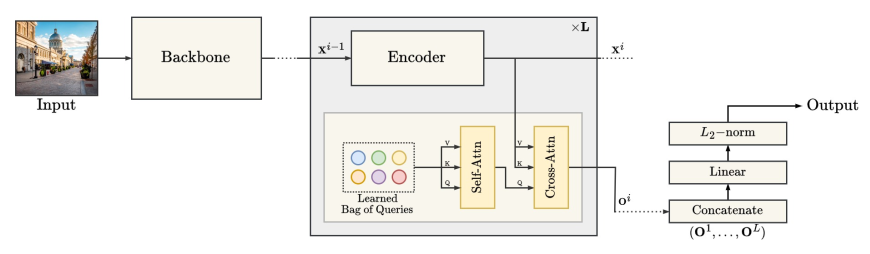

# BoQ: A Place is Worth a Bag of learnable Queries

[](https://paperswithcode.com/sota/visual-place-recognition-on-mapillary-test?p=boq-a-place-is-worth-a-bag-of-learnable)    [](https://paperswithcode.com/sota/visual-place-recognition-on-san-francisco?p=boq-a-place-is-worth-a-bag-of-learnable)  [](https://paperswithcode.com/sota/visual-place-recognition-on-pittsburgh-250k?p=boq-a-place-is-worth-a-bag-of-learnable)  [](https://paperswithcode.com/sota/visual-place-recognition-on-pittsburgh-30k?p=boq-a-place-is-worth-a-bag-of-learnable)    [](https://paperswithcode.com/sota/visual-place-recognition-on-sped?p=boq-a-place-is-worth-a-bag-of-learnable)  [](https://paperswithcode.com/sota/visual-place-recognition-on-st-lucia?p=boq-a-place-is-worth-a-bag-of-learnable)  [](https://paperswithcode.com/sota/visual-place-recognition-on-amstertime?p=boq-a-place-is-worth-a-bag-of-learnable)  [](https://paperswithcode.com/sota/visual-place-recognition-on-nordland?p=boq-a-place-is-worth-a-bag-of-learnable)

This is the official repo for CVPR 2024 paper "BoQ: A Place is Worth a Bag of Learnable Queries"

### Summary

BoQ is a new architecture for visual place recognition that employs a set of global learned queries (Bag-of-Queries) to probe the input’s local features via cross-attention, insuring consistent information aggregation.

[[CVPR OpenAccess](https://openaccess.thecvf.com/content/CVPR2024/html/Ali-bey_BoQ_A_Place_is_Worth_a_Bag_of_Learnable_Queries_CVPR_2024_paper.html)] [[ArXiv](https://arxiv.org/abs/2405.07364)] [[BibTex](https://github.com/amaralibey/Bag-of-Queries?tab=readme-ov-file#cite)]

### Architecture



The input image is first processed by a backbone network (ResNet for example) to extract its local features, which are then sequentially refined in cascade. Each BoQ block contains a set of learnable queries $\mathbf{Q}$ (Learned Bag of Queries). The refined features $\mathbf{X}^i$ are processed through cross-attention with $\mathbf{Q}$ for selective aggregation. Outputs from all BoQ blocks $(\mathbf{O}^1, \mathbf{O}^2, \dots, \mathbf{O}^L)$ are concatenated and linearly projected. The final global descriptor is L2-normalized to optimize it for subsequent similarity search.

## Trained model weights

We used GSV-Cities ([https://github.com/amaralibey/gsv-cities](https://github.com/amaralibey/gsv-cities)) for training, with images resized to 320x320. We tested on 15 large scale benchmarks, as shown in the paper.
Our trained models are available on PyTorch Hub and can be downloaded and used without cloning this repo. Simply call the model using `torch.hub.load` as follows:

```python
import torch
import torchvision.transforms as T

# ResNet50 + BoQ
vpr_model = torch.hub.load("amaralibey/bag-of-queries", "get_trained_boq", backbone_name="resnet50", output_dim=16384)


# DinoV2 + BoQ
vpr_model = torch.hub.load("amaralibey/bag-of-queries", "get_trained_boq", backbone_name="dinov2", output_dim=12288)


# NOTE: when using our models, use the following transform for best results.
im_size = (384, 384) # to be used with ResNet50 backbone
im_size = (322, 322) # to be used with DinoV2 backbone

def input_transform(image_size=im_size):
    return T.Compose([
        T.ToTensor(),
        T.Resize(image_size, interpolation=T.InterpolationMode.BICUBIC, antialias=True),
        T.Normalize(mean=[0.485, 0.456, 0.406], std=[0.229, 0.224, 0.225]),
    ])
```

## Performance

We evaluated BoQ on 15 benchmarks. Below are the results when using ResNet50 and DinoV2 backbones.

#### BoQ wth DinoV2 backbone:

```plaintext
╭─────────────── Recall@k Performance ───────────────╮
│                                                    │
│   Dataset           R@1     R@5    R@10    R@20    │
│  ───────────────────────────────────────────────── │
│   MSLS-val         93.8    96.8    97.0    97.7    │
│   Pitts30k-test    93.7    97.1    97.9    98.5    │
│   Pitts250k-test   96.6    99.1    99.5    99.7    │
│   Nordland**       81.3    92.5    94.8    96.3    │
│   Nordland*        90.6    96.0    97.5    98.5    │
│   SPED             92.5    95.9    96.7    98.0    │
│   AmesterTime      63.0    81.6    85.1    88.5    │
│   Eynsham          92.2    95.6    96.4    97.0    │
│   St-Lucia         99.9    100.0   100.0   100.0   │
│   Svox-night       97.7    99.5    99.8    99.9    │
│   Svox-sun         97.5    99.4    99.5    99.5    │
│   Svox-rain        98.8    99.7    99.8    99.8    │
│   Svox-snow        99.4    99.7    99.9    99.9    │
│   Svox-overcast    98.5    99.3    99.4    99.5    │
│   Svox-all         99.0    99.6    99.7    99.8    │
│----------------------------------------------------│
│   MSLS-Challenge   79.0    90.3    92.0    93.7    │
│   SF-Landmark      93.6    95.8    96.5    97.0    │   
╰────────────────────────────────────────────────────╯
** 1-frame threshold
*  10-frames threshold

```

#### BoQ with ResNet50 backbone:

```plaintext
╭─────────────── Recall@k Performance ───────────────╮
│                                                    │
│   Dataset          R@1     R@5     R@10     R@20   │
│  ──────────────────────────────────────────────────│
│   MSLS-val         91.2    95.3    96.1     96.9   │
│   Pitts30k-test    92.4    96.5    97.4     98.1   │
│   Pitts250k-test   95.0    98.5    99.1     99.4   │
│   Nordland**       70.7    84.0    87.5     90.9   │
│   Nordland*        83.1    91.0    93.5     95.3   │
│   SPED             86.5    93.4    95.7     97.2   │
│   Eynsham          91.3    94.9    95.9     96.5   │
│   AmsterTime       52.2    72.5    78.4     82.5   │
│   St-Lucia         100.0   100.0   100.0    100.0  │
│   Svox-night       87.1    94.4    96.1     97.1   │
│   Svox-sun         95.9    98.8    98.9     99.2   │
│   Svox-rain        96.2    99.5    99.7     99.8   │
│   Svox-snow        98.7    99.5    99.7     99.8   │
│   Svox-overcast    97.8    99.2    99.3     99.4   │
│   Svox-all         98.9    99.4    99.6     99.7   │
╰────────────────────────────────────────────────────╯
** 1-frame threshold
*  10-frames threshold
```

#### Open source code

The Bag-of-Queries (BoQ) technique is easy to implement. Here is the implementation in PyTorch. Note that the self-attention between the learned queries is there for stability purposes (it adds contexts between the learned queries during the training), it can be cached during eval.

Positional encoding are not really necessary (since the 3x3 conv operation is preceding the transformer). If you want to use a lot of BoQ blocks, you can add positional embeding to `x` just before the `norm_input` operation.

```python
import torch

class BoQBlock(torch.nn.Module):
    def __init__(self, in_dim, num_queries, nheads=8):
        super(BoQBlock, self).__init__()
  
        self.encoder = torch.nn.TransformerEncoderLayer(d_model=in_dim, nhead=nheads, dim_feedforward=4*in_dim, batch_first=True, dropout=0.)
        self.queries = torch.nn.Parameter(torch.randn(1, num_queries, in_dim))
  
        # the following two lines are used during training only, you can cache their output in eval.
        self.self_attn = torch.nn.MultiheadAttention(in_dim, num_heads=nheads, batch_first=True)
        self.norm_q = torch.nn.LayerNorm(in_dim)
        #####
  
        self.cross_attn = torch.nn.MultiheadAttention(in_dim, num_heads=nheads, batch_first=True)
        self.norm_out = torch.nn.LayerNorm(in_dim)
  

    def forward(self, x):
        B = x.size(0)
        x = self.encoder(x)
  
        q = self.queries.repeat(B, 1, 1)
        q = q + self.self_attn(q, q, q)[0]
        q = self.norm_q(q)
  
        out, attn = self.cross_attn(q, x, x)  
        out = self.norm_out(out)
        return x, out, attn.detach()


class BoQ(torch.nn.Module):
    def __init__(self, in_channels=1024, proj_channels=512, num_queries=32, num_layers=2, row_dim=32):
        super().__init__()
        self.proj_c = torch.nn.Conv2d(in_channels, proj_channels, kernel_size=3, padding=1)
        self.norm_input = torch.nn.LayerNorm(proj_channels)

        in_dim = proj_channels
        self.boqs = torch.nn.ModuleList([
            BoQBlock(in_dim, num_queries, nheads=in_dim//64) for _ in range(num_layers)])
  
        self.fc = torch.nn.Linear(num_layers*num_queries, row_dim)
  
    def forward(self, x):
        # reduce input dimension using 3x3 conv when using ResNet
        x = self.proj_c(x)
        x = x.flatten(2).permute(0, 2, 1)
        x = self.norm_input(x)
  
        outs = []
        attns = []
        for i in range(len(self.boqs)):
            x, out, attn = self.boqs[i](x)
            outs.append(out)
            attns.append(attn)

        out = torch.cat(outs, dim=1)
        out = self.fc(out.permute(0, 2, 1))
        out = out.flatten(1)
        out = torch.nn.functional.normalize(out, p=2, dim=-1)
        return out, attns
```

### Training and evaluation code

Stay tuned for the release of a new framework, for training and evaluating not only BoQ, but most existing VPR models. Don't forget to star the repo ;) but if you are in a hury, you can use GSV-Cities framework for training ([https://github.com/amaralibey/gsv-cities]()), just copy the code into a new file (e.g. boq.py) into `gsv-cities/models/aggregators/boq.py` and import the class name in the `__init__.py` file.

### Cite

Feel free to use the following bibtex code to cite or paper

```
@InProceedings{Ali-bey_2024_CVPR,
    author    = {Ali-bey, Amar and Chaib-draa, Brahim and Gigu\`ere, Philippe},
    title     = {{BoQ}: A Place is Worth a Bag of Learnable Queries},
    booktitle = {Proceedings of the IEEE/CVF Conference on Computer Vision and Pattern Recognition (CVPR)},
    month     = {June},
    year      = {2024},
    pages     = {17794-17803}
}
```
